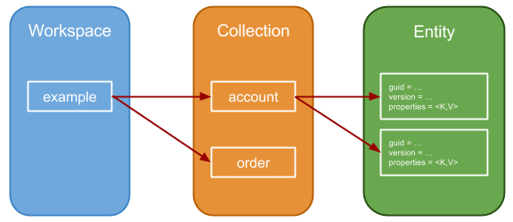

# Introduction

Entity Persistence Service provides a NoSQL abstraction over RDBMS to store entities as schema-less bags of properties (e.g., JSON objects or Java `Map`s). Entities have a GUID and can have multiple versions. The rest of the entity is opaque as far as the datastore is concerned. From a service consumer's perspective, the "schema" of the datastore can be changed simply by storing new properties. In addition, Entity Persistence Service indexes entity properties by flattening them out and persisting them in a different datastore which enables primitive search capabilities.

See http://backchannel.org/blog/friendfeed-schemaless-mysql for technical inspiration.

# Concept

The Entity Persistence Service consists of the following:



## Workspace

A `Workspace` object is the entry point to the API. A `Workspace` has a name which is used to provide namespace isolation. Furthermore, a `Workspace` provides `Entity` CRUD methods.

Restrictions:

* name must be a valid moniker
* name must be less than 256 characters

## Collection

A `Collection` is a group of `Entities`. A `Collection` must have a unique name within a `Workspace`. `Collection`s don't enforce a schema on `Entities` which means that `Entities` in the same `Collection` can contain a different set of properties. 

Restrictions:

* name must be a valid moniker
* name must be less than 256 characters

## Entity

The `Entity` interface encapsulates the actual data that gets persisted.

An `Entity` binds a globally unique identifier (guid) to a `Map` of properties. An `Entity`'s guid can be used to perform quick lookups within the specified `Collection`. All `Entities` have a version (think of it as an etag) which is created whenever an `Entity` is created or updated. Finally, a combination of `Workspace` + `Collection` + `guid` can be used to uniquely identify an `Entity` globally.

Here is the relevant snippet from the `Entity` API:

```
public interface Entity {
    /**
     * Collection the {@link Entity} is part of. Must validate the following
     * regex: [a-zA-Z0-9-/]+
     *
     * @return
     */
    String getCollection();
    /**
     * GUID. Automatically generated by Java. Example:
     * 751f0ac8-c6fe-4adb-b75c-e211e4462b76
     *
     * @return
     */
    String getId();
    /**
     * Tracks the version of the {@link Entity}. This is automatically updated
     * whenever the {@link Entity} is created or updated.
     *
     * @return
     */
    Long getVersion();
    Map<String, String> getProperties();
    // ... other methods ...
}
```


## API
The following APIs can be accessed via the Workspace Object.

### CRUD API

```
/**
 * Create a new {@link Entity} in the specified collection with the
 * specified properties. By default, all properties in the <code>Map</code>
 * will be indexed.
 *
 * @param collection
 * @param properties
 * @return
 * @throws PersistenceServiceException
 * @throws EntityExistsException
 */
Entity create(String collection, Map<String, String> properties)
        throws PersistenceServiceException, EntityExistsException;
/**
 * Create a new {@link Entity} in the specified collection with the
 * specified properties. All properties in the {@link IndexConfiguration}
 * will be indexed.
 *
 * @param collection
 * @param properties
 * @param indexConfiguration
 * @return
 * @throws PersistenceServiceException
 * @throws EntityExistsException
 */
Entity create(String collection, Map<String, String> properties,
        IndexConfiguration indexConfiguration) throws PersistenceServiceException,
        EntityExistsException;
/**
 * Returns the latest version of an {@link Entity} that is part of the
 * specified collection and has the specified id. Returns null otherwise.
 *
 * @param collection
 * @param id
 * @return
 * @throws PersistenceServiceException
 */
Entity read(String collection, String id) throws PersistenceServiceException;
/**
 * Updates an existing {@link Entity} by creating and persisting a new
 * version of itself. All properties in the {@link IndexConfiguration} will
 * be indexed. Will throw {@link StaleEntityException} if the {@link Entity}
 * that's being updated is not the latest version.
 *
 * @param e
 * @return
 * @throws PersistenceServiceException
 * @throws EntityNotFoundException
 * @throws StaleEntityException
 */
Entity update(Entity e) throws PersistenceServiceException,
        EntityNotFoundException, StaleEntityException;
/**
 * Updates an existing {@link Entity} by creating and persisting a new
 * version of itself. By default, all properties in the <code>Map</code>
 * will be indexed. Will throw {@link StaleEntityException} if the
 * {@link Entity} that's being updated is not the latest version.
 *
 * @param e
 * @param indexConfiguration
 * @return
 * @throws PersistenceServiceException
 * @throws EntityNotFoundException
 * @throws StaleEntityException
 */
Entity update(Entity e, IndexConfiguration indexConfiguration)
        throws PersistenceServiceException, EntityNotFoundException, StaleEntityException;
/**
 * Deletes (logical delete) an {@link Entity}. Will throw
 * {@link StaleEntityException} if the {@link Entity} that's being deleted
 * is not the latest version.
 *
 * @param e
 * @throws PersistenceServiceException
 * @throws EntityNotFoundException
 * @throws StaleEntityException
 */
void delete(Entity e) throws PersistenceServiceException,
        EntityNotFoundException, StaleEntityException;
```

### Index Configuration

`IndexConfiguration` lets you control the behavior of the List API. Only those properties specified in the index configuration will be indexed, and therefore, searchable. By default, all properties are indexed. You can specify the `IndexConfiguration` as part of the `create()` and `update()` method.

## List API

```
/**
 * Returns a list of {@link Entity} in the specified collection
 *
 * @param collection
 * @return
 * @throws PersistenceServiceException
 */
List<Entity> list(final String collection) throws PersistenceServiceException;
```

# Examples

Please refer to `com.akamai.open.moonlighting.persistence.service.impl.dao.EntityDaoTest.java` for the latest example. 

## Create an Entity

```
final Map<String, String> props = new HashMap<>();
props.put("hello", "world");
props.put("now", new Date().toString());
props.put("accessed", "1");
 
try {
    final Entity e = persistenceService.getDefaultWorkspace().create("example", props);
    // do something with entity
} catch (PersistenceServiceException | EntityExistsException ex) {
    // do something
}
```

## Read, Update and Delete

```
final Workspace w = persistenceService.getDefaultWorkspace();
try {
    // list api
    List<Entity> entities = w.list(TYPE);
    for (Entity e : entities) {
        Map<String, String> props = e.getProperties();
        Integer accessed;
        try {
            accessed = Integer.valueOf(props.get("accessed"));
        } catch (NumberFormatException ex) {
            accessed = 0;
        }
        if (accessed >= 25) {
            // delete api
            w.delete(e);
        } else {
            props.put("accessed", (accessed + 1) + "");
            e.setProperties(props);
            // update api with indexConfiguration
            w.update(e, new IndexConfiguration("accessed"));
        }
    }
} catch (PersistenceServiceException | EntityNotFoundException | StaleEntityException ex) {
    // do something
}
```

# Dependencies

This component has a dependency on `com.akamai.open.moonlighting.rdbms-connection-service`. You can remove this dependency and implement the following interface instead: 

```
import java.sql.Connection;
import java.sql.SQLException;

public interface RdbmsConnectionService {
    Connection getConnection() throws SQLException;
}
```

It is up to your implementation to provide a reference to a valid `java.sql.Connection`.
